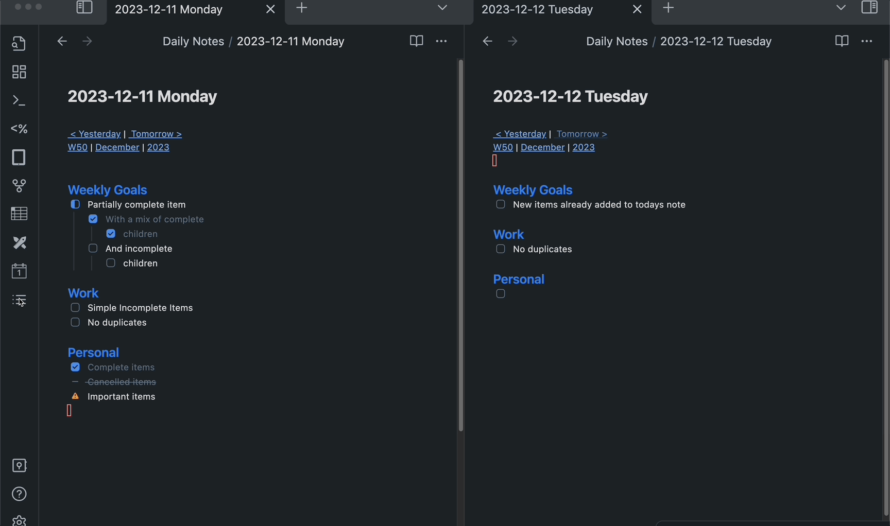

# obsidian-nested-daily-todos

This plugin for [Obsidian](https://obsidian.md/) will parse previous Daily Notes for incomplete todos and add them to
today's Daily Note. It supports grouping the todos by section and supports alternative checkbox states and nested todos.

## Features

- Specify how many days of previous notes to check for incomplete todos
- Support for Todos optionally grouped by headers
- Support for nested Todos
- When Todos with children are carried forward, the entirety of the todo is kept
- Support for alternative [checkbox styles](https://github.com/colineckert/obsidian-things#checkbox-styling) for users using themes like [Things](https://github.com/colineckert/obsidian-things)
- Support for defining which states should be considered complete
- Todos with updated children in more recent notes take precedence over older versions of the same top level item

## How to use
The plugin includes a ribbon icon `Nested Daily Todos` that will add relevant incomplete todos to today's Daily Note.

There is also a command `Add prevoius incomplete todos` that can be ran from the Obsidian command palette.

## How to install
Until the plugin is available in the community plugins gallery, you can install it manually by downloading a release
and unzipping it into your vault's plugins folder.